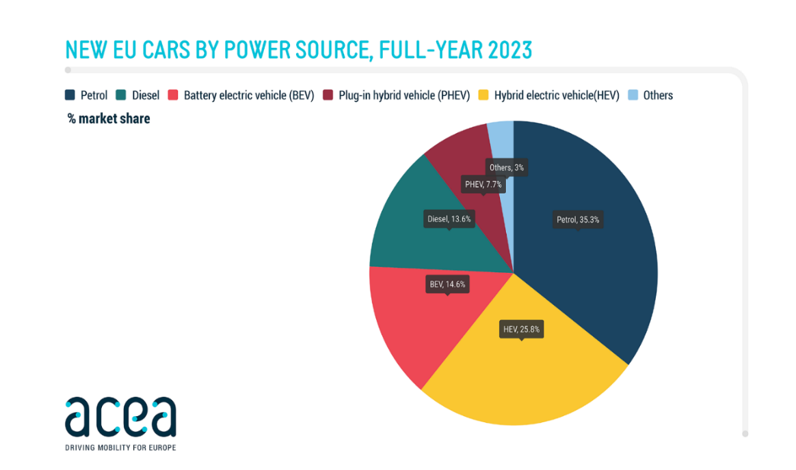

## 1.3 Pojęcie i geneza elektromobilności

Współczesna elektromobilność kojarzona jest głównie z postępem technologicznym ostatnich dekad, ale jej początki sięgają znacznie wcześniej. Historia pierwszych pojazdów elektrycznych rozpoczęła się pod koniec XIX wieku, prawie jednocześnie toczyła się z rozwojem samochodów z silnikiem spalinowym. Początkowo przewaga była po stronie pojazdów zasilanych energią elektryczną, które cechowały się mniejszą hałaśliwością, prostotą eksploatacji oraz brakiem emisji zanieczyszczeń w porównaniu z ówczesnym napędem spalinowym. Mimo pewnych ograniczeń w postaci małego zasięgu i długiego czasu ładowania, samochody elektryczne zdobyły uznanie na drogach miejskich zwłaszcza wśród klasy wyższej[^44].

Z biegiem czasu ich rozwój został jednak przytłumiony przez postępy w przemyśle naftowym, co z kolei skutkowało upowszechnieniem dostępu do benzyny, stopniowe uproszczenie konstrukcji pojazdów spalinowych oraz wdrożenie produkcji taśmowej, która radykalnie obniżyła koszt jednostkowy. W kolejnym stuleciu te czynniki zadecydowały o dominacji pojazdów spalinowych na arenie motoryzacyjnej.

Zainteresowanie napędem elektrycznym powracało falami w drugiej połowie XX wieku głównie w okresach kryzysów naftowych i wzrostu cen ropy. Mimo tego elektromobilność wtedy nie zyskała wielkiego sukcesu ze względu na zbyt wysokie koszty technologii, niska dostępność punktów ładowania oraz ograniczona pojemność ówczesnych akumulatorów. Przełom nastąpił dopiero niedawno, gdy zbiegły się dwa procesy: postęp w obszarze wydajności baterii i zaostrzenie norm emisji gazów cieplarnianych w polityce klimatycznej[^45].

Pojęcie "elektromobilność" stanowi szerokie spektrum aspektów związanych z rozwojem i użytkowaniem pojazdów elektrycznych (ang. Electric Vehicles, EV). Jest to zintegrowany system, który zaczyna się od projektowania i produkcji środków transportu z napędem elektrycznym, przez tworzenie wydajnych akumulatorów, aż po rozbudowanie sieci ładowania i powiązanych procesów wdrażania koncepcji według regulacji prawnych w sprawie zmian klimatu. Elektromobilność nie ogranicza się do definicji pojazdu elektrycznego, tylko rozciąga się na kwestie społeczne, ekonomiczne oraz infrastrukturalne. Obejmuje m.in. mechanizmy wsparcia społecznego, takie jak subsydia, ulgi podatkowe czy inwestycje w rozwój źródeł energii odnawialnej, niezbędnych do zasilania tych pojazdów spójnie z celami ekologicznymi. Warto podkreślić, że w skład elektromobilności wchodzą także elektryczne autobusy, motocykle, skutery, pojazdy mikromobilne, jak hulajnogi. Wspólnym mianownikiem jest wykorzystanie energii elektrycznej jako głównego źródła napędu[^46].

Transport elektryczny dzieli się na poniżej wymienione kategorie w zależności od typu układu napędowego:

1.  BEV (ang. Battery Electric Vehicle)

> Pojazdy tego typu nie posiadają silników spalinowych. Ich napęd opiera się wyłącznie na energii elektrycznej, która jest magazynowana w akumulatorach, ładowanych z zewnętrznych źródeł. Energia zgromadzona w bateriach zasila jeden lub kilka silników elektrycznych. Cechą tego typu rozwiązania jest brak emisji CO2 oraz innych szkodliwych związków chemicznych. Niemniej jednak, wadą pozostaje zasięg jazdy, który wciąż uzależniony jest od pojemności baterii i efektywności systemu zarządzania energią[^47].

2.  HEV (ang. Hybrid Electric Vehicle)

> Samochody hybrydowe, określane tym skrótem, łączą w sobie dwa rodzaje napędu: silnik spalinowy oraz silnik elektryczny. W klasycznych hybrydach silnik elektryczny pełni funkcję wspomagającą, która odciąża główny napęd podczas przyspieszania albo ruszania. Akumulator w pojazdach typu HEV nie jest ładowany z zewnątrz, lecz dzięki energii wynikającej w trakcie hamowania. Ten proces jest definiowany jako rekuperacja. Rekuperacja polega na przekształcaniu energii kinetycznej na energię elektryczną, która ponownie zasila akumulator, co zmniejsza zużycie układu hamulcowego[^48].

3.  PHEV (ang. Plug-in Hybrid Electric Vehicle)

> Pojazdy tego typu, jak i HEV, wyposażone są w dwa układy napędowe elektryczny i spalinowy. Ich główną zaletą jest możliwość jazdy w trybie całkowicie elektrycznym, najczęściej przez kilkadziesiąt kilometrów przy zachowaniu pełnej niezależności od silnika spalinowego. W odróżnieniu od tradycyjnych hybryd akumulatory w PHEV są o większej pojemności i wymagają ładowania z zewnętrznych źródeł. To rozwiązanie umożliwia ograniczenie emisji CO~2~ w warunkach miejskich i codziennych przejazdach, gdy większość trasy może być pokonana bez uruchamiania silnika spalinowego. System zarządzania energią w PHEV automatycznie optymalizuje pracę obu źródeł napędu w zależności od poziomu naładowania, stylu jazdy i warunków drogowych. Pojazd może pracować w trybie tylko elektrycznym, hybrydowym równoległym (oba napędy jednocześnie) lub hybrydowym szeregowym (silnik pełni rolę wspomagającą silnika elektrycznego lub służy do ładowania baterii)[^49].

4.  EREV (ang. Extended-range Electric Vehicle)

> Pojazdy elektryczne, które posiadają wydłużony zasięg dzięki zastosowaniu dodatkowego źródła energii. Głównym napędem pozostaje silnik elektryczny, natomiast jednostka spalinowa pełni funkcję wsparcia, czyli uruchamia się ona w momencie, gdy poziom energii zgromadzonej w akumulatorze nie pozwala na dalszy ruch pojazdu. Wówczas generuje prąd, który pozwala kontynuować jazdę bez konieczności natychmiastowego ładowania z zewnętrznego źródła. Taka konfiguracja pozwala na przejazd łącznie nawet 300-500 kilometrów w jednym cyklu[^50].

5.  FCEV (ang. Fuel Cell Electric Vehicles)

> Pojazdy elektryczne zasilane ogniwami paliwowymi reprezentują technologicznie zaawansowany kierunek rozwoju zrównoważonego transportu. Energia elektryczna powstaje bezpośrednio w samym pojeździe na skutek reakcji chemicznej pomiędzy wodorem a tlenem, zachodzącej w ogniwie paliwowym.

W przeciwieństwie do BEV, w których energia jest magazynowana FCEV nie wymagają dużo czasu na ładowanie. Tankowanie wodoru trwa zaledwie kilka minut. Wytwarzana energia zasila silnik elektryczny, a jedynym produktem ubocznym jest para wodna. Dlatego FCEV są lokalnie zeroemisyjne i przyjazne środowisku. Ze względu na swoje cechy w postaci zasięgu około 500-700 km oraz dość szybkiego tankowania, pojazdy elektryczno-wodorowe wydają się być atrakcyjne w transporcie komercyjnym, m.in. w przypadku ciężarówek i autobusów[^51].

Na przestrzeni ostatnich lat rynek pojazdów elektrycznych w Unii Europejskiej charakteryzuje się znaczną dynamiką, pokazując zarówno wzrost zainteresowania wśród konsumentów, jak i wpływ coraz bardziej ambitnych wymagań regulacyjnych związanych z ochroną środowiska. W 2023 r. w UE udział samochodów elektrycznych typu BEV stanowił 14,6% wszystkich zarejestrowanych aut osobowych w tym roku. Wśród napędów elektrycznych największy udział miały pojazdy typu HEV 25,8%, natomiast hybrydy typu plug-in stanowiły 7,7% (por. Rys. 1)[^52].

**Rysunek 1. Liczba nowych rejestracji samochodów według rodzaju napędu w 2023 roku**

{width="4.680030621172353in" height="2.8333333333333335in"}

Źródło: ACEA, <https://www.acea.auto/pc-registrations/new-car-registrations-13-9-in-2023-battery-electric-14-6-market-share/>, \[dostęp: 17.04.2025\].

Sytuacja uległa zmianie w 2024 roku, kiedy rynek automotive doświadczył spadku sprzedaży EV o 5,9% w stosunku do roku poprzedniego, co przełożyło się na obniżenia liczby rejestracji samochodów BEV o 1,3%, a auta PHEV o 3,9%.[^53]. Głównym powodem była decyzja niemieckiego rządu o zakończeniu programu dopłat do zakupu pojazdów elektrycznych[^54]. Natomiast hybrydy elektryczne (HEV) umocniły swoją pozycję na rynku z udziałem 30,9% ustępując jedynie autom benzynowym[^55].

---

[^44]: Polski Instytut Ekonomiczny, *Jak wspierać elektromobilność,* Warszawa, 2019, s.8, <https://pie.net.pl/wp-content/uploads/2019/10/PIE-Raport_Elektromobilnosc.pdf>, \[dostęp: 16.04.2025\].

[^45]: Ibidem, s.8.

[^46]: M. Wodnicka, M. Malinowski, *Rynek e-mobilności transportu samochodowego Polski i Niemiec,* \[w:\] L. J. Kozar, M. Matusiak (red.), *Współczesne wyzwania transportu, spedycji oraz logistyki -- wybrane aspekty*, Łódź, 2023, s. 56-57, <https://dspace.uni.lodz.pl/bitstream/handle/11089/50128/Kozar_i_in._Wspolczesne_wyzwania--.pdf?sequence=1&isAllowed=y>, \[dostęp: 16.04.2025\].

[^47]: PSPA, *Kompendium elektromobilności,* wydanie II, 2020, s. 26, <https://pspa.com.pl/wp-content/uploads/2020/08/kompendium_elektromobilnosci_raport_2020_S.pdf>, \[dostęp: 16.04.2025\].

[^48]: J. Zawieska, *Rozwój rynku elektromobilności w Polsce,* \[w:\] J. Gajewski, W. Paprocki, J. Pieriegud(red.), *Elektromobilność w Polsce na tle tendencji europejskich i globalnych*, Warszawa, 2019, s.13, <https://www.efcongress.com/wpcontent/uploads/2020/02/publikacje09__Elektromobilno%C5%9B%C4%87-w-Polsce-na-tle-tendencji-europejskich-i-globalnych.pdf>, \[dostęp:16.04.2025\].

[^49]: Y.Yang, W.Jiang, P. Suntharalingam, *Plug-In Hybrid Electric Vehicles,* \[w:\] A. Emadi (ed.), *Advanced Electric Drive Vehicles,* Boca Raton, 2015, s. 466-469, <https://www.aston-recruitment.co.uk/wp-content/uploads/2022/12/Advanced-Electric-Drive-Vehicles-Energy-Power-Electronics-and-Machines-PDFDrive-.pdf>, \[dostęp:16.04.2025\].

[^50]: J. Zawieska, *Rozwój rynku\...,* op.cit., s.13.

[^51]: S. Vengatesan, A. Jayakumar, K. K. Sadasivuni, *FCEV vs. BEV --- A short overview on identifying the key contributors to affordable & clean energy (SDG-7),* Energy Strategy Reviews, volume 53, 2024, <https://www.sciencedirect.com/science/article/pii/S2211467X24000877?via%3Dihub>, \[17.04.2025\].

[^52]: ACEA, *New car registrations: +13.9% in 2023; battery electric 14.6% market share,* 2024*,* <https://www.acea.auto/pc-registrations/new-car-registrations-13-9-in-2023-battery-electric-14-6-market-share/>, \[dostęp: 17.04.2025\].

[^53]: ACEA, *New car registrations: +0.8% in 2024; battery-electric 13.6% market share,* 2025, <https://www.acea.auto/pc-registrations/new-car-registrations-0-8-in-2024-battery-electric-13-6-market-share/>, \[dostęp:17.04.2025\].

[^54]: IEA, *Energy Policy Review: Germany 2025*, 2025, s. 27, <https://iea.blob.core.windows.net/assets/7fea0ad0-1cc1-45e9-810b-2d602e64642f/Germany2025.pdf>, \[dostęp: 03.05.2025\].

[^55]: ACEA, *New car registrations: +0.8%\..., op. cit.*
