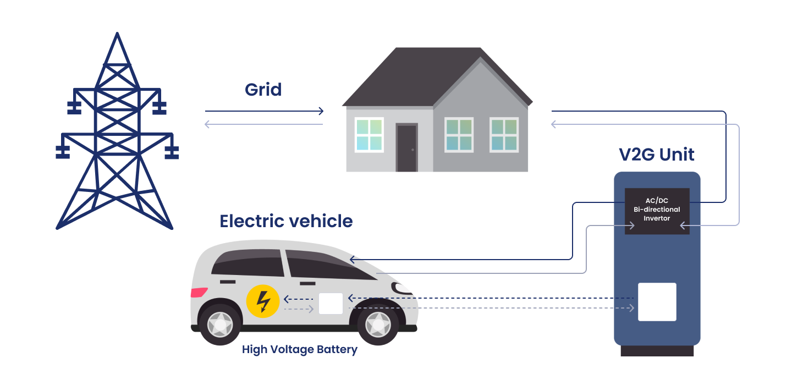

## 2.2. Infrastruktura ładowania i integracja z systemem elektroenergetycznym

Dyskusja nad mechanizmami wsparcia konsumentów w poprzednim podrozdziale prowadzi w sposób naturalny do zagadnienia infrastruktury, która stanowi fundament funkcjonowania rynku pojazdów elektrycznych. Nawet najbardziej atrakcyjne programy dopłat czy ulgi podatkowe nie mogą przynieść trwałych efektów, jeśli nabywca samochodu elektrycznego nie ma dostępu do sieci ładowania gwarantującej mu swobodę podróżowania i bezpieczeństwo energetyczne. Rozbudowa stacji prywatnych i publicznych tworzy więc warunki, w których bezpośrednie wsparcie konsumentów może zostać w pełni wykorzystane. Bez odpowiedniej sieci ładowania samochody elektryczne pozostałyby technologiczną ciekawostką, a nie realną alternatywą w transporcie indywidualnym i zbiorowym.

W raporcie IEA podkreśla się, że prywatne punkty ładowania, szczególnie te instalowane w gospodarstwach domowych, są pierwszym etapem integracji elektromobilności z codziennym życiem konsumentów. Możliwość regularnego ładowania pojazdu w warunkach domowych, najczęściej w porze nocnej, sprzyja postrzeganiu samochodów elektrycznych jako rozwiązania wygodnego i łatwego do zaadaptowania, niewymagającego zasadniczej reorganizacji dotychczasowych przyzwyczajeń komunikacyjnych. Jednocześnie należy podkreślić, że infrastruktura prywatna nie jest w stanie samodzielnie zapewnić pełnej swobody przemieszczania się. Osiągnięcie rzeczywistej dostępności elektromobilności wymaga równoległego rozwoju publicznych stacji ładowania, zlokalizowanych zarówno w przestrzeni miejskiej, jak i wzdłuż głównych ciągów transportowych. Odpowiednia gęstość takich punktów ogranicza niepewność związaną z zasięgiem pojazdów elektrycznych, a tym samym sprzyja podejmowaniu decyzji o ich zakupie[^70].

Publiczna infrastruktura ładowania odgrywa szczególną rolę w dużych aglomeracjach, gdzie liczba gospodarstw domowych z własnym garażem jest ograniczona. Tam właśnie inwestycje w miejskie punkty ładowania decydują o tempie przyjmowania się elektromobilności. Władze lokalne, wspierane przez fundusze europejskie, inwestują w budowę stacji przy centrach handlowych, parkingach zbiorowych i węzłach komunikacyjnych. Tworzy to nowy model użytkowania pojazdu, w którym ładowanie odbywa się nie tylko w domu, lecz także w trakcie wykonywania codziennych czynności.

Rozwój publicznej infrastruktury ładowania w Europie wyraźnie przyspieszył w 2024 roku w porównaniu z rokiem poprzednim. Liczba dostępnych punktów zwiększyła się o ponad 35%, przekraczając łącznie 1 mln. Skala wzrostu jest jednak zróżnicowana między państwami w związku z nierównomiernym tempem rozwoju elektromobilności oraz inwestycji infrastrukturalnych. Na koniec 2024 roku największą krajową siecią dysponowała Holandia (ponad 180 tys. punktów), wyprzedzając Niemcy (160 tys.) i Francję (155 tys.)[^71].

Znaczenie inwestycji infrastrukturalnych dostrzegła również Unia Europejska, włączając elektromobilność do strategii rozwoju korytarzy transportowych TEN-T. Projekty realizowane w ramach tego programu obejmują budowę szybkich stacji ładowania przy głównych autostradach oraz węzłach logistycznych, co ma ułatwić zarówno transport osobowy, jak i ciężarowy. Priorytetem jest stworzenie takich warunków, aby podróż samochodem elektrycznym przez kilka krajów UE była równie przewidywalna jak w przypadku samochodu spalinowego[^72]. Dzięki temu elektromobilność przestaje być kojarzona wyłącznie z transportem miejskim i staje się realną alternatywą także dla dalekich podróży oraz transportu towarów.

Jak wykazano w badaniu przygotowanym przez Fraunhofer ISE i Fraunhofer ISI na zlecenie Transport & Environment, rozwój infrastruktury ładowania jest nie tylko podstawowym warunkiem upowszechnienia samochodów elektrycznych, ale stanowi również istotny element transformacji energetycznej. Każda nowa stacja ładowania generuje dodatkowe obciążenie dla systemu elektroenergetycznego, a równocześnie może pełnić funkcję bufora energii w ramach inteligentnych sieci. Integracja ładowarek z siecią elektroenergetyczną pozwala na bardziej efektywne zarządzanie popytem, stabilizację napięcia oraz magazynowanie nadwyżek z odnawialnych źródeł[^73]. Oznacza to, że rozwój sieci ładowania nie jest jedynie kwestią logistyki transportowej, ale częścią szerszego projektu modernizacji europejskiej energetyki.

Masowa elektryfikacja transportu będzie prowadzić do znaczącego wzrostu obciążenia w godzinach szczytu, szczególnie wówczas, gdy kierowcy będą ładować swoje pojazdy po powrocie z pracy. Bez nowych narzędzi zarządzania przepływami energii system może doświadczać przeciążeń, co w dłuższej perspektywie zwiększa ryzyko lokalnych blackoutów[^74]. Zgodnie z wynikami scenariusza referencyjnego opracowanego przez Fraunhofer ISE i ISI, całkowite zapotrzebowanie na energię elektryczną w Europie zwiększy się z ponad 3 500 TWh w 2030 r. do ponad 5 100 TWh w 2040 r., a produkcja energii będzie w coraz większym stopniu oparta na źródłach odnawialnych -- przede wszystkim na energetyce wiatrowej i fotowoltaice[^75].

W odpowiedzi na te wyzwania rozwijane są rozwiązania z zakresu Smart Grid, umożliwiające dynamiczne sterowanie procesem ładowania. Inteligentna sieć energetyczna to zintegrowany system, który łączy różne elementy infrastruktury energetycznej i umożliwia dwukierunkową komunikację między wytwórcami a odbiorcami energii. W rezultacie pozwala to na bardziej efektywne i racjonalne wykorzystanie i zarządzanie energią elektryczną[^76].

Pojazdy elektryczne są znaczącym ogniwem w łańcuchu kompleksowej koncepcji Smart Grid. Dynamiczny rozwój elektromobilności oraz nowoczesne technologie umożliwili coraz szerszą integrację EV z systemem energetycznym za pomocą systemu V2G (Vehicle-to-Grid). Technologia V2G pozwala pojazdom nie tylko pobierać energię z sieci do ładowania baterii, lecz również przekazywać ją z powrotem[^77].

**Rysunek 2. Koncepcja V2G**\
{width="5.389258530183727in" height="2.6189129483814524in"}

Źródło: Erbis, [https://erbis.com/blog/v2g-startups-in-energy/,](https://erbis.com/blog/v2g-startups-in-energy/) \[dostęp: 17.11.2025\].

Realizacja tej technologii opiera się na zastosowaniu ładowarek dwukierunkowych, systemy komunikacji z siecią elektroenergetyczną oraz oprogramowanie kontrolujące przepływy energii. Uzupełnieniem są magazyny energii, które ograniczają przeciążenia i stabilizują pracę całego systemu[^78]. Efektem tego rozwiązania jest to, że pojazdy elektryczne mogą pełnić funkcję mobilnego magazynu energii. Z perspektywy konsumenta oznacza to większą wygodę użytkowania, uproszczoną obsługę oraz możliwość obniżenia kosztów ładowania. W odniesieniu do sieci elektroenergetycznych V2G może zapewniać zasilanie awaryjne podczas przerw w dostawie prądu oraz magazynowanie energii z własnych instalacji OZE i jej wykorzystanie[^79].

Dwukierunkowe ładowanie pojazdów może odegrać kluczową rolę w bilansowaniu sieci i ograniczaniu przeciążeń w aglomeracjach. W scenariuszu „Car I" samochody osobowe oddają z powrotem do systemu 47 TWh energii w 2030 r., a w bardziej ambitnym scenariuszu „Car II" aż 124 TWh -- co odpowiada 1--3% całkowitej podaży energii elektrycznej. Do 2040 r. udział ten wzrasta do 6--9%, co wskazuje na rosnące znaczenie mobilnych magazynów energii w stabilizacji systemu elektroenergetycznego[^80].

---

[^70]: International Energy Agency, Global EV Outlook 2025, 2025, s. 99, [https://iea.blob.core.windows.net/assets/7ea38b60-3033-42a6-9589-71134f4229f4/GlobalEVOutlook2025.pdf,](https://iea.blob.core.windows.net/assets/7ea38b60-3033-42a6-9589-71134f4229f4/GlobalEVOutlook2025.pdf) \[dostęp: 17.11.2025\].

[^71]: Ibidem.

[^72]: Study by Fraunhofer ISE & Fraunhofer ISI on behalf of Transport & Environment, *Potential of a full EV-power-system-integration in Europe*, Karlsruhe, 2024, s. 15-19,

    <https://www.transportenvironment.org/uploads/files/2024_10_Study_V2G_EU-Potential_Final.pdf>, \[dostęp: 07.07.2025\].

[^73]: Fraunhofer ISE, Fraunhofer ISI, *Potential of a full EV-power-system-integration in Europe & how to realise it*, Transport & Environment, Brussels 2024, s. 28--29, https://www.transportenvironment.org/uploads/files/2024_10_Study_V2G_EU-Potential_Final.pdf \[dostęp: 19.10.2025\].

[^74]: Sarda J., Patel N., Patel H., Vaghela R., Brahma B., Bhoi A.K., Barsocchi, P., *A review of the electric vehicle charging technology, impact on grid integration, policy consequences, challenges and future trends*, Energy reports, 2024, vol. 12, s. 5682, <https://www.sciencedirect.com/science/article/pii/S2352484724007674> \[dostęp: 07.07.2025\].

[^75]: Fraunhofer ISE & ISI, *Potential of a full EV-power-system integration in Europe and how to realise it*, Europe,Karlsruhe, 2024, s. 28, https://www.transportenvironment.org/uploads/files/2024_10_Study_V2G_EU--Potential_Final.pdf, \[dostęp: 17.11.2025\].

[^76]: PSPA, *Pojazdy elektryczne jako element sieci elektroenergetycznych,* Warszawa, 2018, s.8, <https://psnm.org/wp-content/uploads/2020/08/V2G_raport_S.pdf>, \[dostęp: 17.11.2025\].

[^77]: Ibidem, s.10.

[^78]: Nexdrive, *V2G -- Samochód elektryczny jako mobilny magazyn energii,* 15.05.2025, <https://nexdrive.pl/v2g-samochod-elektryczny-jako-mobilny-magazyn-energii>, \[dostęp: 17.11.2025\].

[^79]: Eaton, *Podstawy ładowania pojazdów elektrycznych,* Gdańsk, 2024, s. 28, <https://www.eaton.com/content/dam/eaton/markets/buildings/buildings-as-a-grid/assets/eaton-essential-guide-to-electric-vehicle-charging-pl-pl.pdf>, \[dostęp: 18.11.2025\].

[^80]: Fraunhofer ISE & ISI, *Potential of a full EV\...,* op.cit., s. 29, https://www.transportenvironment.org/uploads/files/2024_10_Study_V2G_EU--Potential_Final.pdf, \[dostęp: 17.11.2025\].
