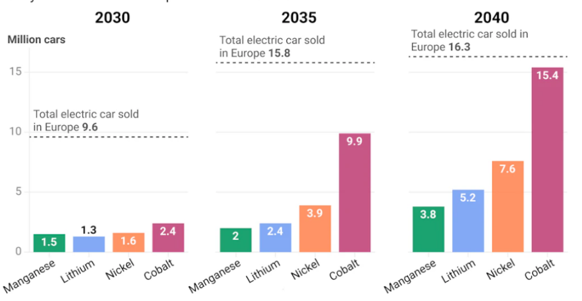
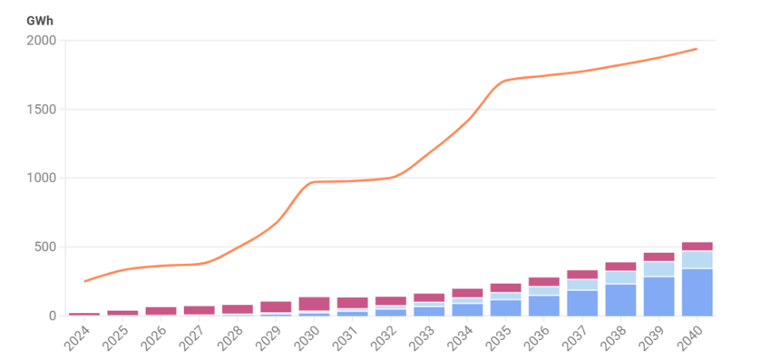

## 2.3. Wpływ elektromobilności na sektor motoryzacyjny i przemysłowy

Rozwijający się sektor elektromobilności prowadzi do powstania nowych modeli biznesowych. Rozszerzanie rynku EV tworzy popyt na innowacyjne produkty i usługi, wspierając dalszą ekspansję tego segmentu. Oprócz rozwoju technologii alternatywnych układów napędowych wraz z technologią magazynowania energii, obserwuje się poważne zmiany w strategiach producentów. Adaptują oni swoją działalność do nowych realiów rynkowych, wychodząc poza tradycyjną rolę wytwórcy pojazdów[^81].

Aby ograniczyć barierę wysokiej ceny zakupu pojazdów elektrycznych, niektórzy producenci oferują model leasingu akumulatorów. W praktyce to wygląda tak, że bateria nie jest kupowana razem z pojazdem, a tylko oferowana w ramach osobnej umowy. Konsument zyskuje możliwość wymiany akumulatora oraz zmniejsza ryzyko związane z długoterminową eksploatacją baterii[^82]. Na przykład, francuski koncern motoryzacyjny Renault był jednym z pierwszych, kto zaoferował klientom możliwość leasingu baterii. Dzięki temu udało się obniżyć cenę pojazdu. Miesięczna opłata za akumulator obejmowała jego serwis oraz gwarancję wymiany, co zwiększało atrakcyjność oferty dla klientów[^83].

Równolegle rozwija się sektor recyklingu akumulatorów. Wraz ze wzrostem liczby pojazdów elektrycznych na rynku rośnie też ilość baterii. Do 2030 popyt może osiągnąć poziom 970 GWh, a w kolejnej dekadzie ta wartość potencjalnie wzrośnie do 2 TWh. W tej perspektywie recykling nie jest już postrzegany jako działalność marginalna, lecz jako niezbędna część gospodarki[^84]

Jak pokazano na Rysunku 3, ilość zużytych akumulatorów i odpadów produkcyjnych w kolejnych dekadach wzrasta wykładniczo. W latach 30. XXI wieku obserwuje się zbieżność pomiędzy rosnącym zapotrzebowaniem na baterie a strumieniem materiałów wtórnych, które mogą być ponownie wykorzystane. Oznacza to, że gospodarka recyklingowa ma szansę stać się pełnoprawnym partnerem dla przemysłu pierwotnego. Dla koncernów oznacza to konieczność rozwijania powiązań z firmami zajmującymi się odzyskiem i tworzenia nowych łańcuchów dostaw, w których odpady przekształcają się w surowiec.

**Rysunek 2. Potencjalna produkcja BEV z materiałów pochodzących z recyklingu w Europie**

{width="5.675675853018372in" height="2.9861909448818897in"}

Źródło: Transport & Environment, From waste to value: the potential for battery recycling in Europe, 2024.

Jak pokazuje Rysunek 2, do 2040 roku recykling kobaltu, niklu, litu i manganu może zapewnić materiały pozwalające na produkcję milionów pojazdów elektrycznych rocznie. Dane te wskazują, że rozwój elektromobilności wymusza nie tylko zmiany strategiczne w koncernach, ale również tworzy nowe sektory gospodarki związane z odzyskiem surowców. W ten sposób transformacja nie jest zjawiskiem jednostronnym -- ma charakter multiplikacyjny, tworząc nowe miejsca pracy w obszarach wcześniej marginalnych i zmieniając mapę przemysłową Europy.

Proces transformacji koncernów motoryzacyjnych prowadzi bezpośrednio do restrukturyzacji całego sektora przemysłowego. Zamknięcie produkcji silników spalinowych jest nie tylko efektem regulacji europejskich, ale również konsekwencją zmiany struktury popytu. Wraz ze spadkiem sprzedaży pojazdów wyposażonych w tradycyjne napędy, maleje potrzeba utrzymywania zakładów produkujących układy tłokowe i skrzynie biegów. Oznacza to redukcję zatrudnienia w tych gałęziach, a jednocześnie przesunięcie kapitału i zasobów w kierunku obszarów związanych z elektromobilnością[^85].

Na miejsce dawnych fabryk wchodzą gigafabryki baterii, których rozwój ma charakter strategiczny dla Europy. Wytwarzanie akumulatorów staje się fundamentem nowej gałęzi przemysłu, wymagającej zarówno znacznych inwestycji, jak i innowacji technologicznych. Budowa i funkcjonowanie takich zakładów generują efekt mnożnikowy -- wokół głównej produkcji powstają mniejsze podmioty zajmujące się logistyką, testowaniem komponentów czy dostarczaniem materiałów pomocniczych. Proces ten prowadzi do stopniowego przekształcania mapy gospodarczej kontynentu, w której tradycyjne ośrodki motoryzacyjne ustępują miejsca nowym centrom przemysłu akumulatorowego[^86].

Równolegle rozwija się sektor recyklingu akumulatorów. Wraz ze wzrostem liczby pojazdów elektrycznych na rynku rośnie też ilość baterii, które po kilkunastu latach eksploatacji trafiają do recyklingu. W tej perspektywie recykling nie jest już postrzegany jako działalność marginalna, lecz jako niezbędna część gospodarki. Warto zwrócić uwagę, że odzyskiwanie litu, kobaltu i niklu z baterii pozwala nie tylko ograniczyć koszty produkcji, ale także zmniejszyć zależność Europy od dostawców zewnętrznych. Otwiera to przestrzeń do powstawania nowych wyspecjalizowanych branż, które generują miejsca pracy i zwiększają wartość dodaną w regionach przemysłowych.

**Rysunek 3. Odpady baterii w porównaniu z zapotrzebowaniem na baterie w sektorze EV i ESS (2024--2040)** {width="6.083333333333333in" height="2.8905905511811025in"}

Źródło: *Transport & Environment. (2024). From waste to value: the potential for battery recycling in Europe. Brussels: T&E, <https://www.transportenvironment.org/articles/from-waste-to-value-the-potential-for-battery-recycling-in-europe>*, \[dostęp: 11.07.2025\]

Efekt multiplikacyjny obejmuje także sektory powiązane. Malejący popyt na paliwa płynne prowadzi do spadku znaczenia przemysłu petrochemicznego, który zmuszony jest szukać nowych rynków zbytu. W tym samym czasie sektor energetyczny zyskuje nowe źródła dochodów, stając się filarem elektromobilności. Rozwój odnawialnych źródeł energii dodatkowo wzmacnia ten proces, ponieważ tylko wówczas elektryfikacja transportu może odpowiadać celom klimatycznym. Elektromobilność staje się więc katalizatorem zmian nie tylko w przemyśle motoryzacyjnym, ale i w całej gospodarce, powodując przesunięcie akcentów w stronę sektorów niskoemisyjnych[^87].

Restrukturyzacja ma charakter systemowy: od przemysłu produkcyjnego, przez sektor surowców, aż po rynek pracy. Jest to proces, który nie przebiega równomiernie w całej Europie -- w jednych regionach oznacza utratę tradycyjnych miejsc pracy, w innych otwiera nowe możliwości rozwoju. Jednak wspólnym mianownikiem pozostaje rosnące znaczenie innowacyjnych gałęzi gospodarki i powstawanie nowych sieci współpracy, które redefiniują strukturę europejskiego przemysłu.

---

[^81]: McKinsey & Company, *Electric vehicles in Europe: gearing up for a new phase*, 2014, s.50, <https://www.mckinsey.com/~/media/McKinsey/Locations/Europe%20and%20Middle%20East/Netherlands/Our%20Insights/Electric%20vehicles%20in%20Europe%20Gearing%20up%20for%20a%20new%20phase/Electric%20vehicles%20in%20Europe%20Gearing%20up%20for%20a%20new%20phase.pdf>, \[dostęp: 20.11.2025\].

[^82]: Ibidem, s.51.

[^83]: P. Sharma, *5 Battery Leasing Giants Driving the EV Revolution,* 25.02.2025*,* <https://www.gminsights.com/blogs/battery-leasing-service-contenders-taking-steps-to-consolidate-presence>, \[dostęp: 20.11.2025\].

[^84]: Transport & Environment, *From waste to value*, 2024,

[^85]: Transport & Environment, *From waste to value: the potential for battery recycling in Europe,* Brussels, 2024, <https://www.transportenvironment.org/articles/from-waste-to-value-the-potential-for-battery-recycling-in-europe>, \[dostęp:10.07.2025\].

[^86]: Ibidem.

[^87]: Strategy&PwC, *European battery recycling market analysis,* Strategy&Report, 2025, <https://www.strategyand.pwc.com/de/en/industries/automotive/recycling-european-battery.html>, \[dostęp: 11.07.2025\].
