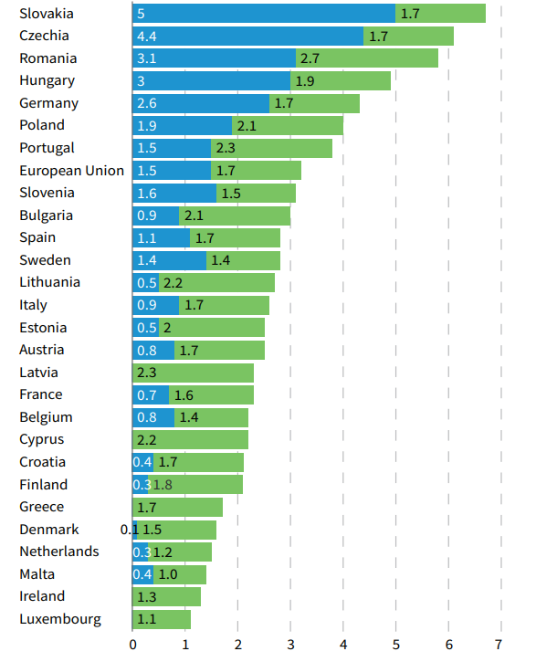

## 3.3. Wpływ na rynek pracy i transformację kompetencji

Transformacja sektora motoryzacyjnego w Unii Europejskiej, wynikająca z przejścia od technologii spalinowych do napędów elektrycznych, wiąże się z głębokimi zmianami w strukturze zatrudnienia. W szczególności dotyczy to gałęzi przemysłu skoncentrowanych na produkcji silników spalinowych oraz tradycyjnych usługach serwisowych. Eurofound w najnowszym raporcie dotyczącym zatrudnienia w przemyśle motoryzacyjnym podkreśla, że kraje takie jak Słowacja, Czechy, Rumunia, Węgry i Niemcy, w których udział zatrudnienia w sektorze motoryzacyjnym przekracza 3--5% ogółu zatrudnienia, są najbardziej narażone na skutki transformacji[^108].

Redukcja popytu na pojazdy spalinowe prowadzi do stopniowego ograniczania liczby miejsc pracy w fabrykach produkujących silniki i skrzynie biegów. W raporcie Europejskiego Banku Inwestycyjnego pokazano, że do 2040 roku w Europie może zniknąć około 500 000 miejsc pracy związanych z motoryzacją tradycyjną, przy obecnym scenariuszu wdrażania pojazdów elektrycznych. Natomiast spodziewane jest powstanie około 230 000 nowych stanowisk w branży elektromobilności. W tym około 200 000 będzie dotyczyć wszystkich ogniw w łańcuchu produkcji akumulatorów, a blisko 30 000 miejsc pracy obejmie wytwarzanie silników elektrycznych[^109].

Zmiany dotykają również sektor usług posprzedażowych, zwłaszcza tradycyjnych warsztatów samochodowych. Pojazdy elektryczne mają znacznie prostszą konstrukcję układu napędowego, co oznacza mniejsze zapotrzebowanie na naprawy związane z silnikami, układami wydechowymi czy skrzyniami biegów. Europejski Bank Inwestycyjny wskazuje, że serwis samochodów elektrycznych wymaga nie tylko mniejszej liczby pracowników, lecz także zupełnie nowych kompetencji związanych z diagnostyką elektroniczną, obsługą oprogramowania oraz bezpieczeństwem pracy przy wysokim napięciu. Tym samym warsztaty skoncentrowane na tradycyjnych naprawach mechanicznych będą zmuszone do przebudowy swojej działalności lub ryzykują utratę klientów[^110].

Na przedstawione zmiany nakłada się wyraźne zróżnicowanie geograficzne. Dane Eurofound (2025) pokazują, że w krajach takich jak Niemcy, Polska czy Węgry sektor motoryzacyjny stanowi od 2 do 3% ogółu zatrudnienia, a więc jego restrukturyzacja może mieć poważne konsekwencje dla całych regionów przemysłowych. Szczególnie newralgiczne są tereny przygraniczne, gdzie lokalna gospodarka często w całości opiera się na jednej lub dwóch fabrykach samochodowych. Redukcja miejsc pracy w takich lokalizacjach może prowadzić do wzrostu bezrobocia, emigracji zarobkowej oraz pogłębiania nierówności regionalnych. To z kolei wymusza konieczność opracowania strategii łagodzenia skutków transformacji, zarówno na poziomie unijnym, jak i krajowym.

**Rysunek 4.** **Zatrudnienie w sektorze motoryzacyjnym według krajów jako procent ogółu zatrudnienia (2023)**

{width="3.365216535433071in" height="2.7552121609798776in"}

*Źródło: Eurofound, 2025,* [*ht*tps://www.eurofound.europa.eu/en/publications/all/employment-eus-automotive-sector#abstract](https://www.eurofound.europa.eu/en/publications/all/employment-eus-automotive-sector#abstract).

Nie bez znaczenia pozostaje również rozwój infrastruktury ładowania. Według Transport & Environment w 2025 roku Europa powinna osiągnąć poziom co najmniej 3 milionów ogólnodostępnych punktów ładowania, aby sprostać zapotrzebowaniu rosnącej floty pojazdów elektrycznych. Każdy z tych punktów wymaga zaangażowania pracowników nie tylko w procesie budowy, ale także w utrzymaniu, modernizacji i obsłudze cyfrowej. Tworzy to nowe miejsca pracy w sektorze energetycznym, budowlanym oraz IT, a także stwarza przestrzeń do rozwoju specjalistycznych usług opartych na danych, takich jak zarządzanie flotami czy inteligentne systemy planowania zużycia energii. Dzięki temu elektromobilność wspiera także cyfryzację transportu i gospodarki[^111].

Szczególnie ważne stają się także kompetencje związane z recyklingiem baterii. Wraz ze wzrostem liczby pojazdów elektrycznych rośnie ilość zużytych akumulatorów, które wymagają bezpiecznego i efektywnego zagospodarowania. Wymusza to rozwój wyspecjalizowanych zakładów recyklingu oraz wzrost zatrudnienia w obszarach związanych z odzyskiwaniem cennych surowców, takich jak lit, kobalt czy nikiel. Proces ten nie tylko redukuje koszty produkcji nowych baterii, lecz także wpisuje się w cele gospodarki obiegu zamkniętego, wspieranej przez politykę klimatyczną i przemysłową Unii Europejskiej.

Nie można jednak pomijać wyzwań związanych z adaptacją rynku pracy do nowych realiów. Zmiany wymagają od pracowników tradycyjnych gałęzi przemysłu zdobycia nowych umiejętności, co wiąże się z koniecznością szeroko zakrojonych programów szkoleniowych i przekwalifikowania. Dane Eurofound wskazują, że choć w latach 2024--2025 obserwowane będą znaczące redukcje zatrudnienia w Niemczech, Polsce czy Czechach, to równolegle pojawiają się obszary wzrostu -- szczególnie w krajach inwestujących w produkcję baterii i rozwój zielonej energii. Pokazuje to poniższa tabela, obrazująca restrukturyzację zatrudnienia w sektorze motoryzacyjnym w 2024 roku:

**Tabela 3. Restrukturyzacja w sektorze motoryzacyjnym -- ogłoszenia i oczekiwane zmiany zatrudnienia, 2024**

  ---------------------------------------------------------------------------------------------
  Kraj              Liczba ogłoszeń   Utrata miejsc pracy   Nowe miejsca pracy   Zmiana netto
  ----------------- ----------------- --------------------- -------------------- --------------
  Austria           8                 --1 900               0                    --1 900

  Belgia            4                 --5 547               0                    --5 547

  Bułgaria          3                 --2 350               101                  --2 249

  Czechy            5                 --2 630               0                    --2 630

  Francja           18                --3 689               2 400                --1 289

  Niemcy (bez VW)   26                --33 585              200                  --33 385

  Niemcy (z VW)     27                --68 585              200                  --68 385

  Węgry             3                 0                     1 310                +1 310

  Włochy            2                 --1 670               0                    --1 670

  Niderlandy        2                 --500                 0                    --500

  Polska            17                --3 638               790                  --2 848

  Portugalia        1                 --350                 0                    --350

  Słowacja          2                 --207                 70                   --137

  Słowenia          2                 --770                 0                    --770

  Hiszpania         4                 --761                 1 107                +346

  Szwecja           4                 --2 000               0                    --2 000

  UE (bez VW)       101               --59 597              5 978                --53 619

  UE (z VW)         102               --94 597              5 978                --88 619

  Norwegia          2                 --150                 0                    --150
  ---------------------------------------------------------------------------------------------

*Źródło: Eurofound, 2025.*

Na podstawie danych przedstawionych w tabeli można zauważyć, że w wielu krajach, zwłaszcza w Niemczech i Polsce, przewidywane są duże straty miejsc pracy w sektorze tradycyjnej motoryzacji. Jednak w równoległych procesach inwestycyjnych -- jak w przypadku Węgier czy Hiszpanii -- obserwuje się dodatnie saldo zatrudnienia. Wskazuje to na rosnące znaczenie działań restrukturyzacyjnych, które nie tylko zmniejszają negatywne skutki transformacji, ale także tworzą fundamenty dla nowej gospodarki opartej na czystych technologiach.

Istotnym elementem odpowiedzi na wyzwania rynku pracy stają się programy unijne, takie jak *Just Transition Mechanism*. Jego celem jest wsparcie regionów najbardziej narażonych na negatywne skutki transformacji energetycznej i przemysłowej. Mechanizm ten obejmuje nie tylko pomoc finansową, lecz także wsparcie dla inicjatyw szkoleniowych i edukacyjnych, które mają na celu przygotowanie pracowników do nowych zadań. W praktyce oznacza to inwestycje w centra szkoleniowe, współpracę z uczelniami technicznymi oraz tworzenie partnerstw z przedsiębiorstwami, które potrzebują wykwalifikowanej kadry. Dzięki temu transformacja może przebiegać w sposób bardziej sprawiedliwy, minimalizując ryzyko marginalizacji grup społecznych uzależnionych od sektora tradycyjnej motoryzacji.

---

[^108]: Eurofound (European Foundation for the Improvement of Living and Working Conditions), *Employment in the EU's automotive sector - Briefing note,* 2025, s. 1-3, <https://www.eurofound.europa.eu/en/publications/all/employment-eus-automotive-sector#abstract>, \[dostęp:02.08.2025\].

[^109]: European Investment Bank, *Recharging the batteries: How the electric vehicle revolution is affecting Central, Eastern and South-Eastern Europe,* Luxembourg, 2022, s. 92, <https://www.eib.org/files/publications/econ_recharging_the_batteries_en.pdf>, \[dostęp: 02.08.2025\].

[^110]: European Investment Bank, *Recharging the batteries: How the electric vehicle revolution is affecting Central, Eastern and South-Eastern Europe,* Luxembourg, 2022, s. 72-73, <https://www.eib.org/files/publications/econ_recharging_the_batteries_en.pdf>, \[dostęp: 02.08.2025\].

[^111]: T&E, *Europe's automotive industry at a crossroads,* Brussels, 2025, s. 14-17, <https://www.transportenvironment.org/uploads/files/202505_industrial_policy_new.pdf>, \[dostęp: 03.08.2025\].
